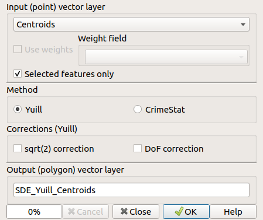

.. linedirectionhistogram documentation master file, created by
   sphinx-quickstart on Sun Feb 12 17:11:03 2015.
   You can adapt this file completely to your liking, but it should at least
   contain the root `toctree` directive.

********************************************
The QGIS Standard Deviational Ellipse Plugin
********************************************

.. toctree::
   :maxdepth: 2

The QGIS Standard Deviational Ellipse plugin implements the
method presented in
`The Standard Deviational Ellipse; An Updated Tool for Spatial Description`_
Robert S. Yuill.
Geografiska Annaler. Series B, Human Geography.
Vol. 53, No. 1 (1971), pp. 28-39.
URL: https://www.jstor.org/stable/490885

Apparently, there are many definitions of a Standard
Deviational Ellipse.
CrimeStat implements a method that produces different results
from the Yuill method, and this method is offered as an
alternative.  This method is also implemented in the R `aspace`
package.
   
Functionality
=================

- The QGIS Standard Deviational Ellipse plugin can be used to
  investigate point patterns, showing a summary of the
  distribution as a standard deviational ellipse.

- Output is a polygon layer with the standard deviational
  ellipse as the only feature.
  The following attributes are available in the output (SDE)
  layer:

  * `meanx`
  * `meany`
  * `majoranglerad` (major axis angle in radians
    counter-clockwise relative to x/east)
  * `directiondeg` ("compass" direction - degrees
    clockwise relative to north)
  * `majorsd` (SD along the major axis)
  * `minorsd` (SD along the minor axis that is normal
    to the major axis)
  * `eccentricity` (sqrt(1-b²/a²)).

Options
=============

The plugin GUI offers a number of options:

|sde_gui|

Choices:

- For the Yuill method, a *Weight field* can be used
  (if the layer has a numeric attribute).

- *Selected features only* to be used (if no features are
  selected, all features will be used)

- Select method

  - *Yuill* (see introduction)

  - *CrimeStat* (as implemented in the R package aspace)

- For the Yuill method, it is possible to use *DoF correction*
  (DoF: Degrees of Freedom) and *sqrt(2) correction*
  (to make the standard deviational ellipse equal to the
  standard distance deviation when the distribution of points
  is random and even in all directions).
  With both of these corrections applied, the result will be
  the same as for the CrimeStat method.

The suggested name for the output layer is:
`SDE_<method>_<input_layer_name>`.
But that can be modified.

Implementation
================

The calculations of the standard deviational ellipse parameters
is performed in a separate thread that reports its progress
through the progressbar in the GUI.

Versions
===============
The current version is 3.0.5.

- 3.0.5: Eliminated the superfluous "Standard deviational ellipse"
  submenu under the Vector menu. GUI and documentation fixes.
- 3.0.4: Fixed issue with selected features in QGIS 3.
- 3.0.3: Fixed issue with integer fields from Shapefile
  format datasets not being accepted as weights.
- 3.0.2: Make icon show in the toolbar and make help show
- 3.0.1: SDE polygon closed to make it valid.
- 3.0.0: Update to the QGIS 3.0 API. GUI rearranged.
- 1.2.1: Help button added. Double quotes removed from the
  output layer name.
- 1.2.0: "Compass" direction and eccentricity added (for the
  major axis). Fixed DOF calculations. GUI and robustness
  improvements.
- 1.1: CrimeStat option added. More options added.
  GUI modifications.
- 1.0: First official version.

Links
=======

`Standard Deviational Ellipse Plugin`_

`Standard Deviational Ellipse code repository`_

`Standard Deviational Ellipse issues`_

Robert S. Yuill: `The Standard Deviational Ellipse; An Updated Tool for Spatial Description`_

Bin Wang, Wenzhong Shi and Zelang Miao: `Confidence Analysis of Standard Deviational Ellipse and Its Extension into Higher Dimensional Euclidean Space`_

Jianxin Gong: `Clarifying the Standard Deviational Ellipse`_

Ned Levine: `CrimeStat IV, Part II Spatial Description`_

Citation
==========

Would you like to cite / reference this plugin?

Tveite, H. (2016). The QGIS Standard Deviational Ellipse Plugin. http://plugins.qgis.org/plugins/SDEllipse/.

Bibtex:

.. code-block:: latex

  @misc{tveitesde,
    author =   {Håvard Tveite},
    title =    {The {QGIS} {Standard} {Deviational} {Ellipse} Plugin},
    howpublished = {\url{http://plugins.qgis.org/plugins/SDEllipse/}},
    year = {2016--2020}
  }

.. _The Standard Deviational Ellipse; An Updated Tool for Spatial Description: https://www.jstor.org/stable/490885
.. _Standard Deviational Ellipse code repository: https://github.com/havatv/qgisstandarddeviationalellipseplugin.git
.. _Standard Deviational Ellipse Plugin: http://arken.nmbu.no/~havatv/gis/qgisplugins/SDEllipse
.. _Standard Deviational Ellipse issues: https://github.com/havatv/qgisstandarddeviationalellipseplugin/issues
.. |N2| replace:: N\ :sup:`2`
.. _Confidence Analysis of Standard Deviational Ellipse and Its Extension into Higher Dimensional Euclidean Space: http://www.ncbi.nlm.nih.gov/pmc/articles/PMC4358977/
.. _Clarifying the Standard Deviational Ellipse: http://onlinelibrary.wiley.com/doi/10.1111/j.1538-4632.2002.tb01082.x/pdf
.. _CrimeStat IV, Part II Spatial Description: http://nij.gov/topics/technology/maps/documents/crimestat-files/CrimeStat%20IV%20Chapter%204.pdf
